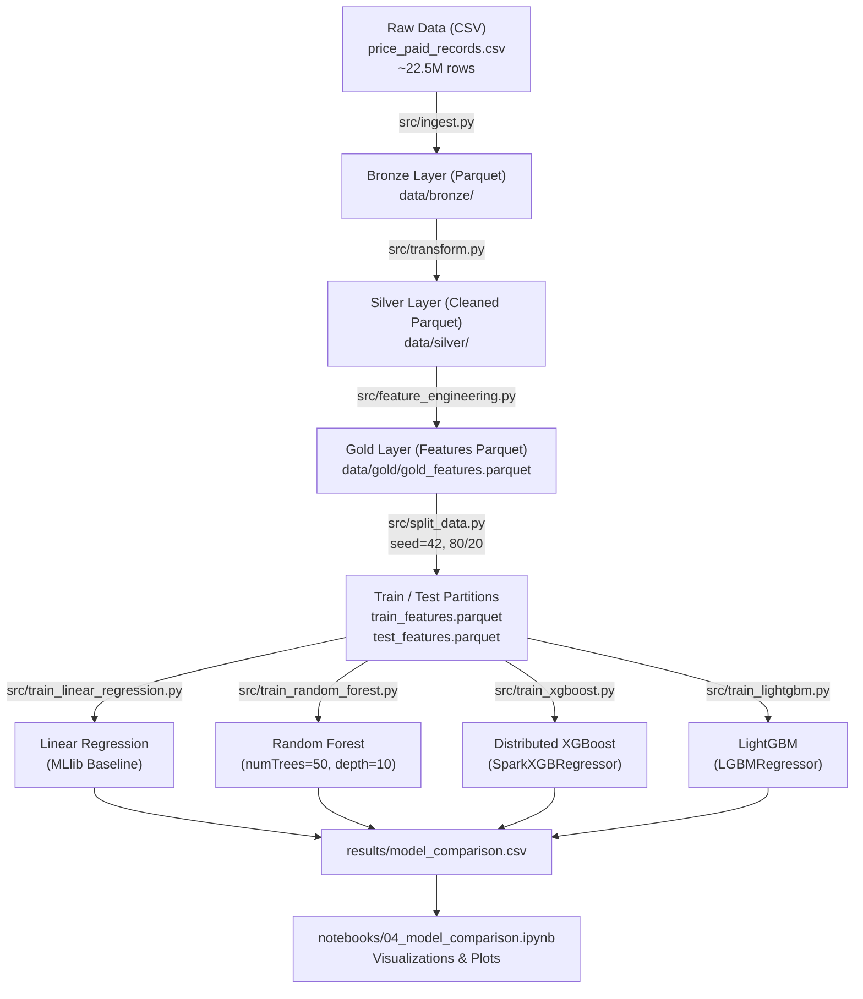

# UK Housing Price Prediction — Distributed ML with Apache Spark

A scalable, end-to-end distributed machine learning pipeline for predicting UK residential property transaction prices across England and Wales using **Apache Spark 3.5.0**, **PySpark MLlib**, **Distributed XGBoost**, and **LightGBM**.

---

## 🏗️ Architecture: Medallion Data Pipeline (Bronze → Silver → Gold)



---

## 📁 Repository Structure

```
uk-housing-distributed-ml/
├── README.md                                  # Comprehensive architecture and usage guide
├── Dockerfile                                 # Spark 3.5 cluster image with ML dependencies
├── docker-compose.yml                         # 1 Master (port 8080/7077) + 3 Workers (8081-8083)
├── requirements.txt                           # PySpark, XGBoost, LightGBM, Pandas, Arrow, etc.
├── run_all.sh                                 # Complete end-to-end execution pipeline script
│
├── config/
│   └── spark.conf                             # Spark cluster runtime configurations
│
├── data/
│   ├── raw/
│   │   └── price_paid_records.csv             # Raw Land Registry dataset
│   ├── bronze/                                # Raw ingestion Parquet layer
│   ├── silver/                                # Cleaned, deduplicated, type-validated Parquet
│   └── gold/                                  # Engineered feature vectors & train/test splits
│       ├── gold_features.parquet
│       ├── train_features.parquet
│       └── test_features.parquet
│
├── src/
│   ├── __init__.py
│   ├── utils.py                               # SparkSession builder, metrics evaluator, JSON I/O
│   ├── ingest.py                              # CSV -> Bronze Parquet loader
│   ├── transform.py                           # Bronze -> Silver cleaning & deduplication
│   ├── feature_engineering.py                 # Silver -> Gold temporal extraction & StringIndexer
│   ├── split_data.py                          # 80/20 Train/Test split (seed=42)
│   ├── train_linear_regression.py             # Linear Regression baseline model
│   ├── train_random_forest.py                 # Spark MLlib RandomForestRegressor
│   ├── train_xgboost.py                       # Distributed XGBoost (SparkXGBRegressor)
│   ├── train_lightgbm.py                      # LightGBM Regressor with SynapseML/native fallback
│   └── aggregate_results.py                   # Aggregates metrics to model_comparison.csv
│
├── notebooks/
│   ├── 01_profiling.ipynb                     # Bronze data profiling & null/price distribution
│   ├── 02_etl.ipynb                           # Silver layer cleaning & validation
│   ├── 03_feature_engineering.ipynb           # Gold features & StringIndexer verification
│   └── 04_model_comparison.ipynb             # Benchmark plots (MAE, RMSE, R², training/pred time)
│
└── results/
    ├── transform_log.txt                      # Step-by-step cleaning drop log
    ├── feature_names.json                     # Engineered feature column metadata
    ├── profiling_results.json                 # Spark-aggregated profiling summary
    ├── linear_regression_metrics.json         # Linear Regression evaluation metrics
    ├── random_forest_metrics.json             # Random Forest evaluation metrics
    ├── xgboost_metrics.json                   # XGBoost evaluation metrics
    ├── lightgbm_metrics.json                  # LightGBM evaluation metrics
    ├── model_comparison.csv                   # Unified benchmark table
    ├── models/                                # Persisted model artifacts
    │   ├── linear_regression.spark/
    │   ├── random_forest.spark/
    │   ├── xgboost.spark/
    │   └── lightgbm.spark/
    ├── linear_regression_predictions.parquet  # Test predictions
    ├── random_forest_predictions.parquet
    ├── xgboost_predictions.parquet
    ├── lightgbm_predictions.parquet
    └── plots/                                 # Visualization PNGs
        ├── mae_comparison.png
        ├── rmse_comparison.png
        ├── r2_comparison.png
        ├── training_time_comparison.png
        └── prediction_time_comparison.png
```

---

## 🚀 Quickstart & Execution

### 1. Launch Docker Spark Cluster
Ensure Docker is running, then launch the master and 3 worker nodes:
```bash
docker compose up -d
```
Inspect the Spark Master UI at [http://localhost:8080](http://localhost:8080) and Worker UIs at ports 8081, 8082, 8083.

### 2. Execute Complete Pipeline
Run all phases sequentially via the container:
```bash
bash run_all.sh
```
Or execute individual steps via `docker exec`:
```bash
# Phase 1: Ingest raw CSV to Bronze Parquet
docker exec spark-master python3 /opt/spark/work-dir/src/ingest.py

# Phase 2: Clean & standardize to Silver Parquet
docker exec spark-master python3 /opt/spark/work-dir/src/transform.py

# Phase 3: Feature Engineering & 80/20 Train-Test split
docker exec spark-master python3 /opt/spark/work-dir/src/feature_engineering.py
docker exec spark-master python3 /opt/spark/work-dir/src/split_data.py

# Phase 4: Train & evaluate models
docker exec spark-master python3 /opt/spark/work-dir/src/train_linear_regression.py
docker exec spark-master python3 /opt/spark/work-dir/src/train_random_forest.py
docker exec spark-master python3 /opt/spark/work-dir/src/train_xgboost.py
docker exec spark-master python3 /opt/spark/work-dir/src/train_lightgbm.py

# Phase 5: Aggregate metrics
docker exec spark-master python3 /opt/spark/work-dir/src/aggregate_results.py
```

### 3. Interactive Analysis & Notebooks
Open the notebooks in `notebooks/` using Jupyter or VS Code / IDE:
- `01_profiling.ipynb`: Raw Bronze distribution, IQR price outliers, null distributions.
- `02_etl.ipynb`: Silver layer validation checks.
- `03_feature_engineering.ipynb`: Encoders and feature vector checks.
- `04_model_comparison.ipynb`: Multi-model charts and performance comparisons.

---

## 📊 Evaluation & Metrics
All models are evaluated on the exact same 20% test partition (`seed=42`) using:
- **MAE** (Mean Absolute Error) in £
- **RMSE** (Root Mean Squared Error) in £
- **R²** (Coefficient of Determination)
- **Training Time** (seconds)
- **Prediction / Inference Time** (seconds)
